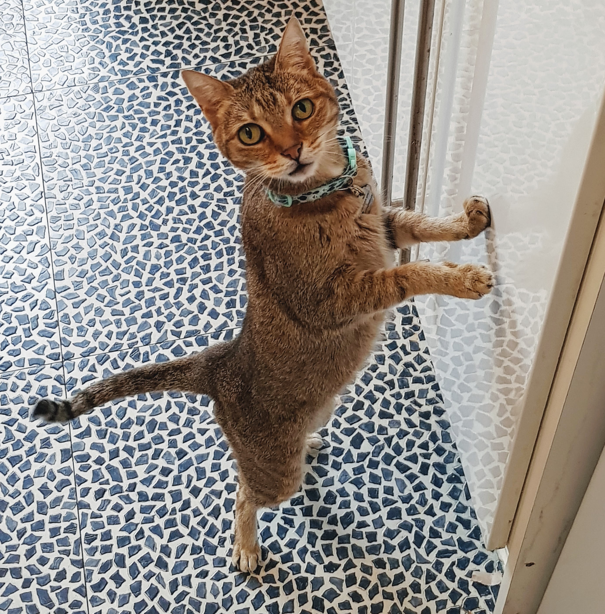

<!-- Paragraph -->
Newlines don't mean anything unless there's more than one. You can split your text 
into lines as you please.

A new paragraph will only start if you put an empty line in between them.

# Title title 

_content_ **content**  _**content**_. 


### third header 

RVU brands:
* uswitch 
* money 
* mojo

1. step1
2. step2
3. step3

- step4 

[to places](https://github.com/KiraK03/my-codef-site)

Click [here](https://www.boots.com/flowflex-antigen-rapid-test-lateral-flow-self-testing-kit-4-kit-bundle-10314028) for google

<!-- image-->
Like this 
 


<iframe width="560" height="315" src="https://www.youtube.com/embed/mNEUkkoUoIA" title="YouTube video player" frameborder="0" allow="accelerometer; autoplay; clipboard-write; encrypted-media; gyroscope; picture-in-picture" allowfullscreen></iframe>

```
this is code block
```